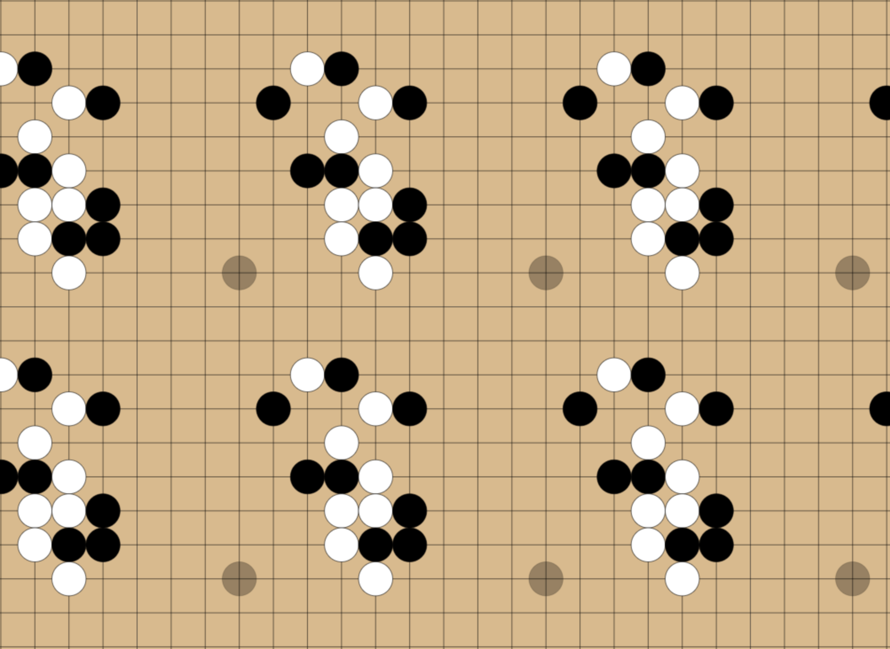
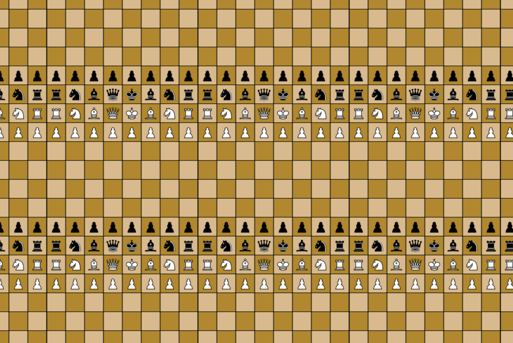
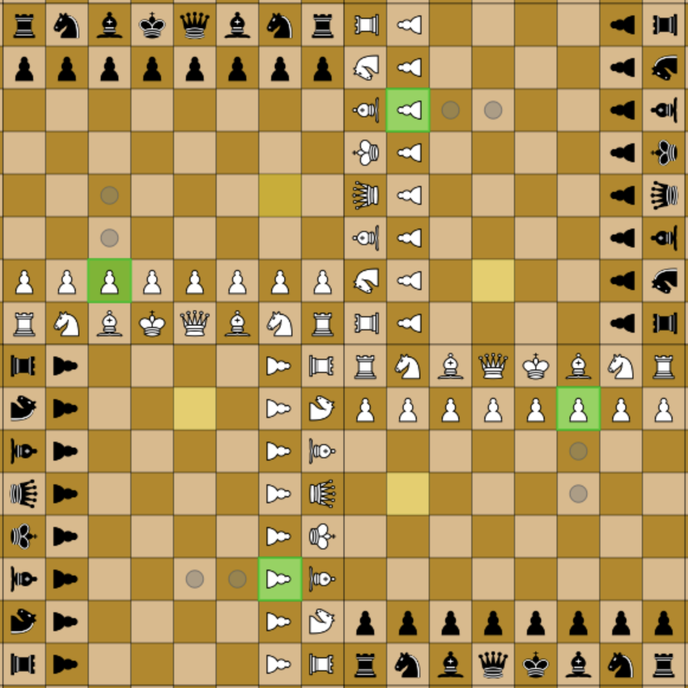
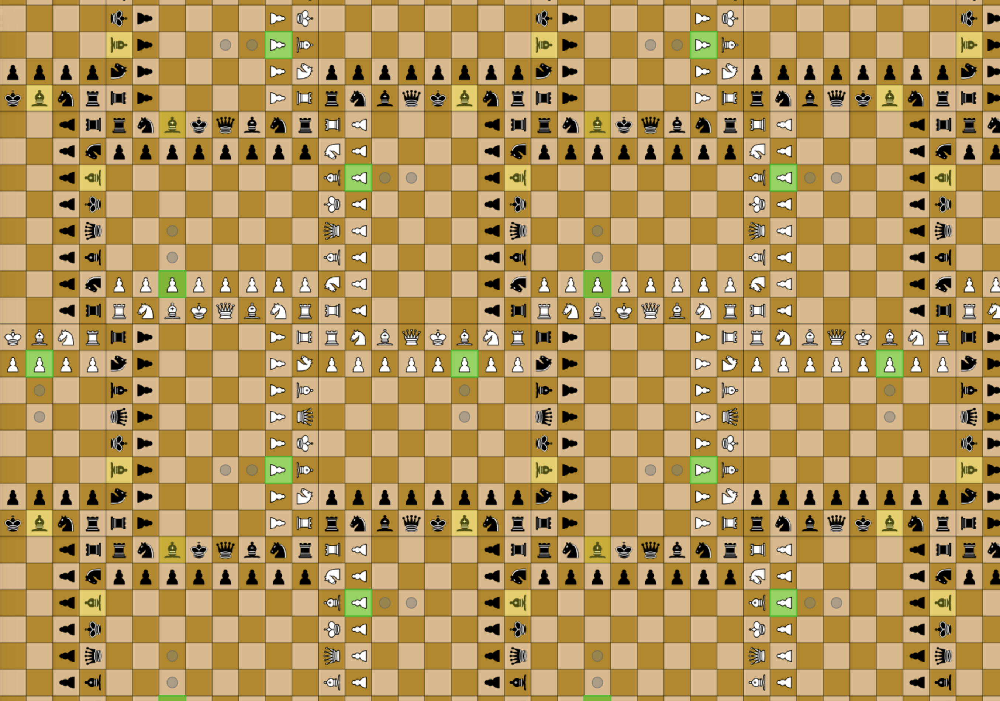

# topologic-go

Have your children been experimenting with non-euclidean spaces?

This readme serves as an explanation of the project, as well as my own notes used in designing these games.

!NOTE! None of these games are perfect. The rules are not implemented perfectly. Do not use for competitive play!

# Torus Go

This one is real simple. It's the game of Go, played on a torus. "On a torus" is the mathematical way to say that the edges wrap around.

The goal of Go is to surround your opponent's stones, whcih makes the corners and edges of the board important regions to control, having less exposed perimeter. If you were to play on a board with no edges, there would be no more corners or edges at all. You can try to play this version of go in go.html.

Why does the board repeat?

 
If we map a torus to a flat surface, it looks like it repeats on all sides. Remember that you are still playing on a normally sized board and placing down one stone at a time, but you can see around the board in both directions. It's sort of like if you were to look around the entire planet and see the back of your own head. 

 

# Torus Chess

Putting chess on a torus presents a problem. When the backs of the boards touch, the most powerful pieces can attack eachother right away, so the game ends on the first move.
 
 

So we can't just stick chess on a torus - at least not if we want interesting games. We need to either alter the rules of the game (which I'm trying not to do) or alter the rules of out space. Let's try some other options:

# Reflected Toroidal Chess

If we mirror the board before we tessellate it, we avoid the back-to-back problem and get a workable game. 
#todo! 

# Spherical Chess

We can't map chess smoothly onto a torus, but we can map it nicely onto a Sphere! how cool is that! 

- The tesselation space will be 4 chessboards. These boards will be "pointing" clockwise: the bottom left board has white pieces at the bottom, black pieces at the top. The top left board is rotated to have white pieces against the left edge and black against the right edge, and so on.
- this pattern creates a "windmill" shape of white pieces in the middle.

This creates the "rotation space" for the game.

This 4-board group is then tesselated across the infinite plane.

Pieces can move continuously (as in, according to their standard movement rules) through the rotation space (the 4-board rotational space) AND the teseslation space (the infinite repetitions of the 4-board group). It's important to remember that there's only one of each piece. these tesselation and rotation views are just to make it simpler to see where the pieces can reach at any given moment (yes, this really is the simplet way to see that - according to some definitions of simpler!)

Implement this game system with multiple sets of coordintes:
ROTATION COORDINATES, ranging from 0 to 15 for X and Y.
TESSELATION COORDINATES, beginning at (0,0) for the grid in the middle and moving by +-1 as the user drags the game board around.

TO calculate where a piece can move, do the following: - for that piece, on it's "true" (unrotated, untessellated) board, calculate each the coordinates for where that piece could move. - If any of these coordinates extend off the side of the board, continue the pathfinding into the adjacent board. implement this with wraparound math for the base board. do NOT involve the rotated or tesselated boards. - Now, you should have a set of coordinates on the base board of where this piece can move, including those that wrap around the edges. Fill those spaces in with grey and red circles as per usual. - rotate and tesselate this board across the entire screen as per the rotation and tessellation rules.

DATA STORAGE:

- true_board: 8x8 matrix that stores pieces.
  - values are populated by pieces being moved by the player.
- rotation_board: 16x16 matrix that stores 4 rotated copies of the true_board.
  - the true_board is one quarter of this rotation_board.
  - values for the other 3 quarters are populated as transformations from the true_board.
- drawn_board: infinite by infinite board.
  - values are populated by mod16 from the rotation_board.

CALCULATING POSSIBLE MOVES:

- getting the set of possible moves is handled entireley inside of the true_board.
- pieces move according to their standard chess piece rules.
- IF a piece is blocked by the edge of the board, they "roll over" using a special case of "overflow rules". for (x, y) points:
  - if x>8, new point is (y, x-8)
  - if y>8, new point is (x, y-8)
  - if x < 0, new point is (y, 8-x)
  - if y < 0, new point is (8-y, x)
- given these rules, all possible moves are calculated for the true_board.
- these moves are then drawn on the rotation_board according to the rules of the rotation space.
- the drawn_board is then duplicated across the entire screen according to the tesselation rules.

TODO 
- crowning
  - pawns must move 7 tiles to crown
- checkbox for allow checkmate moves