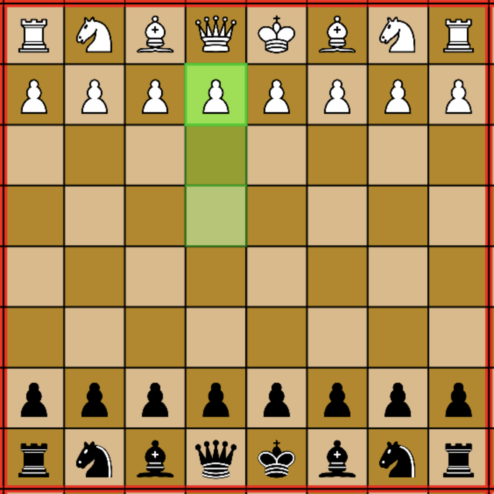
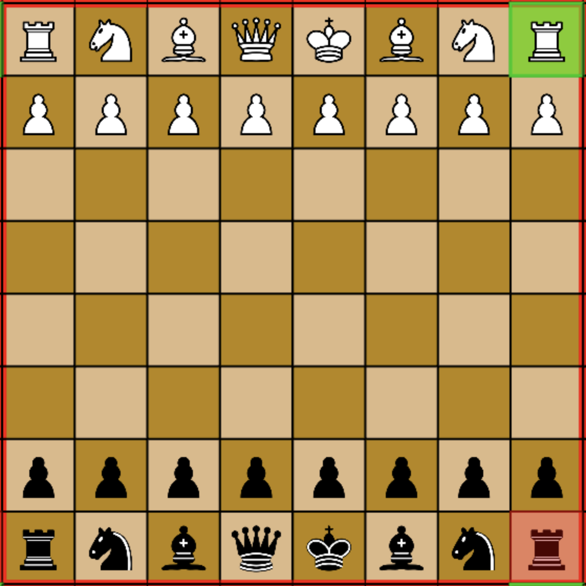
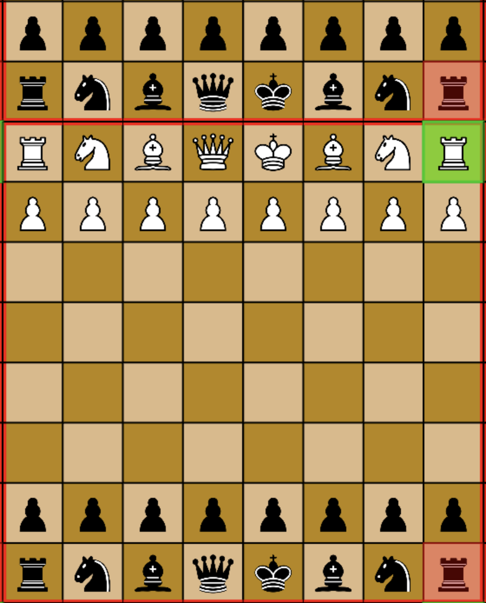
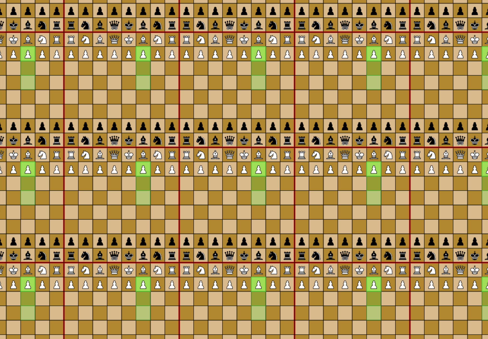
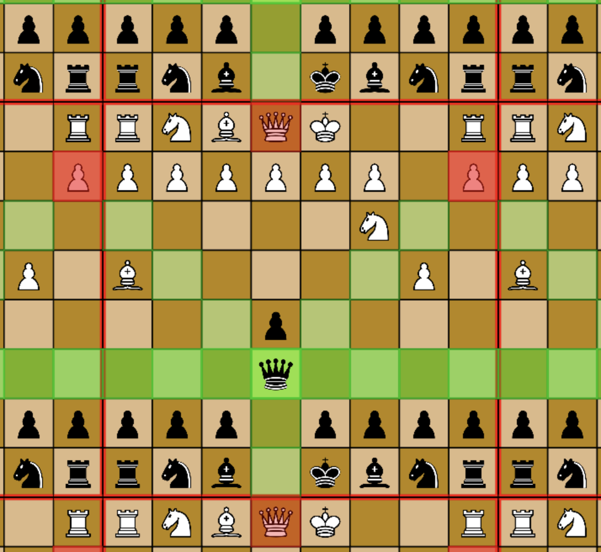
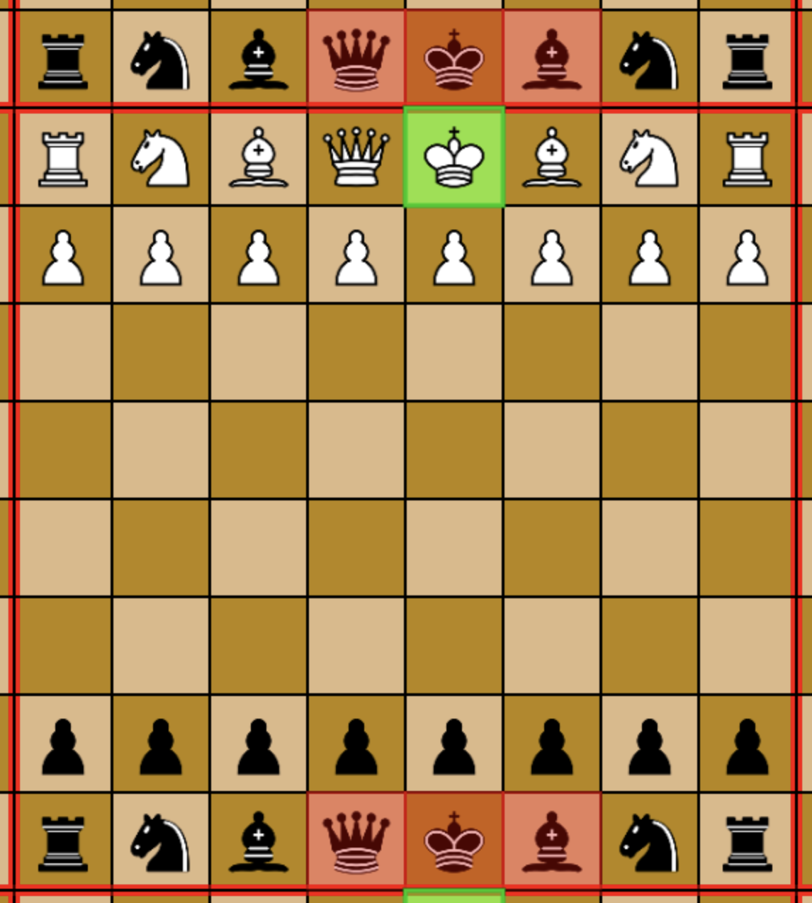
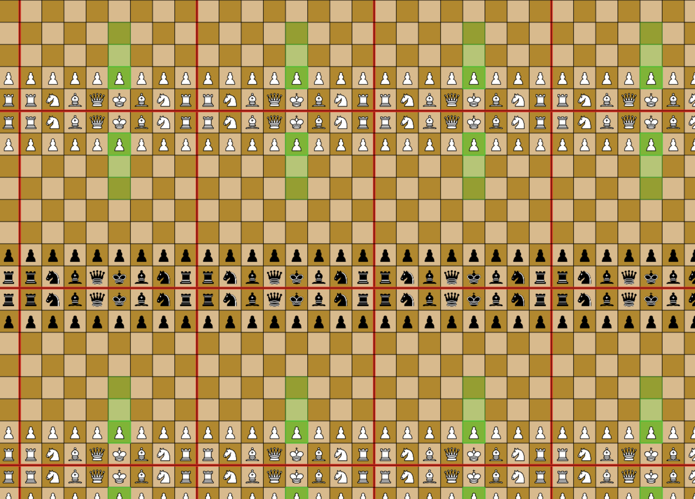
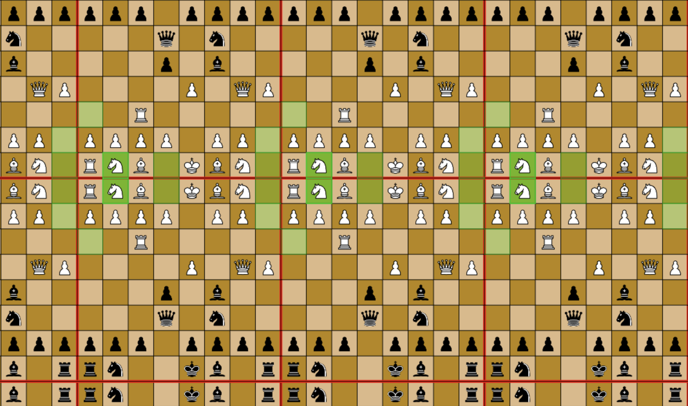
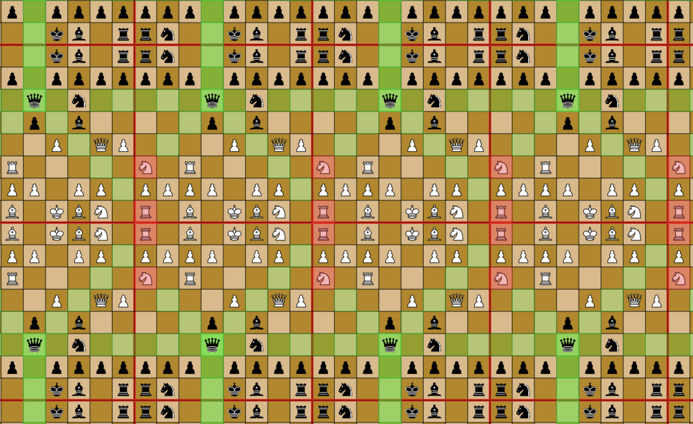

Let's begin with "Torus Chess". Click on this white pawn to see it's possible moves. Looks pretty standard, right? 

Now let's look at a white rook's options on turn 1. 

Apparently this white rook can capture a black rook across the board. This is because we've embedded this chessboard on a torus - or, put another way, the edges of the board "wrap around" and connect with one another. The white rook steps off the top row and into the bottom row, moving 1 square in a straight line upwards, capturing the black rook at the bottom. 

One way to understand these roles is with a simple formula for translating our coordinates as we step past the edges of the board. We're doing the same thing in all directions, so here's the full set of rules: 

`The row below row 0 is row 8.`

`The row above row 8 is row 0.`

`The row below col A is col H.`

`The row above col H is col A.`

Another way to understand this is to re-draw the board in a repeating pattern. Note that we are not playing ches on an infinite board - we are seeing the same board multiple times. It's like looking into two parallel mirrors and seeing an infinite number of your reflections extend into the distance. The board is outlined in red in these pictures. 

The advantage of this representation is that we can move our pieces "normally", because we store our wacky edge traversal rules in the representation of the board. 

We can see here that the white knight can attack several black pieces by stepping over the back edge of the board, and a rook on the opposite corner of the board by stepping across both edges. 

Here a queen can attack the same pawn from two directions, as well as stepping backwards off the board to attack the white queen. Normally, the black pawn in front would block reaching this white queen. 

You may notice a small problem with torus chess. Here's the issue:

On plain torus chess, the white pieces can step "backwards" and take the black king on the first move. Chess doesn't really work on a torus. 

### More Topological Games

The solution is to embed the board on more complex geometries! A basic fix is "Torus Reflected Chess". Here's what that looks like: 

What we've done here is this: 

`Rows roll down and reverse: 3, 2, 1, 0, 0, 1, 2, 3...`

`Rows roll up and reverse:   5, 6, 7, 8, 8, 7, 6, 5...`

`The row below col A is col H.`

`The row above col H is col A.`

It's the same thing horizontally, but the vertical rows reflect before they tessellate. This produces these infinte tubes of pieces that face eachother. You still get walls of pawns approaching eachother, but you have to attack on both sides at once. You'll be attacking from both sides of all of your "tubes", and attacking both sides of your opponent's "tubes" at once. Remember that there's still just one chessboard with one set of pieces - this is the "infinite mirrors" view that actually makes it *easier* to tell what's going on. 

